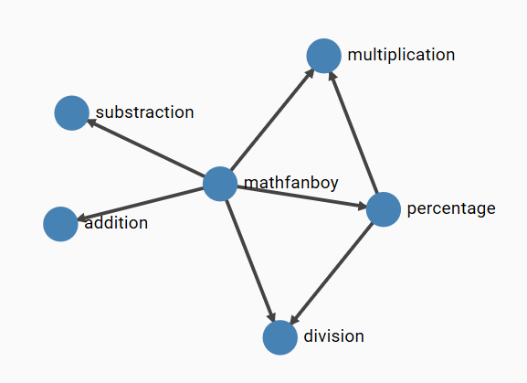

# grpc-calculator-linkerd
 This sample application is intended to help .NET Core developers finding their way with gRPC and [LinkerD2](https://github.com/linkerd/linkerd2). It provides a series of microservices deployed as a calculator.  Each service is a single mathematical operation:
 * Division: this one throws from time to time a division by zero to let LinkerD catch and report them
 * Multiplication
 * Addition
 * Substraction
 * Percentage: this one calls Multiplication followed by Division
 
The MathFanBoy console generates traffic so as to randomly call one of these mathematical operations. The purpose is to watch how the Service Mesh (LinkerD) helps identifying the flows (observability), monitoring the errors, etc. Feel freel to visit the LinkerD web site or [my blog post](https://techcommunity.microsoft.com/t5/azure-developer-community-blog/meshing-with-linkerd2-using-grpc-enabled-net-core-services/ba-p/1377867) that explains the rationale behind using gRPC & LinkerD. 

After having installed the solution + LinkerD, you should be able to visualize how services do call each other, as shown below:



where one can indeed see Mathfanboy calling every operation as well as Percentage calling multiplication & division. 

# Prerequisites
To get this demo app up & running, you need the following:
* A K8s cluster. 
* Install LinkerD2: read their [getting started walkthough](https://linkerd.io/2/getting-started/). You can stop at step 4. 

# Testing the app locally with plain docker
If you're only interested in viewing gRPC in action, you can test this locally.

* Build the docker files that are in the root folder. Rename them one by one to DockerFile. 

```
docker build . -t calcadd:dev
docker run -p 5001:80 -t calcadd:dev
docker build . -t calcdivide:dev
docker run -p 5002:80 -t calcdivide:dev
docker build . -t calcmultiply:dev
docker run -p 5003:80 -t calcadd:multiply
docker build . -t calcsubstract:dev
docker run -p 5004:80 -t calcsubstract:dev
docker build . -t calcpercentage:dev
docker run -p 5005:80 -t calcpercentage:dev

```
* Build MathFanboy in Debug mode, as a plain .Net Core console. No Docker in order to avoid having to build a local Docker network. The code contains a ifdebug preprocessing directive that targets the endpoints using the above ports.

# Deploy to AKS (or any other K8s cluster)
All the container images are hosted on my personal Docker Hub repos, so you don't need to build anything yourself if you just want to see this in action. Just make sure to comply with the prerequisites.

```
curl -sL https://github.com/stephaneey/grpc-calculator-linkerd/blob/master/grpc-calculator-linkerd.yaml \
  | kubectl apply -f -  
```
Alternatively, you can download https://github.com/stephaneey/grpc-calculator-linkerd/blob/master/grpc-calculator-linkerd.yaml, followed by:

```
kubectl apply -f ./grpc-calculator-linkerd.yaml
```
